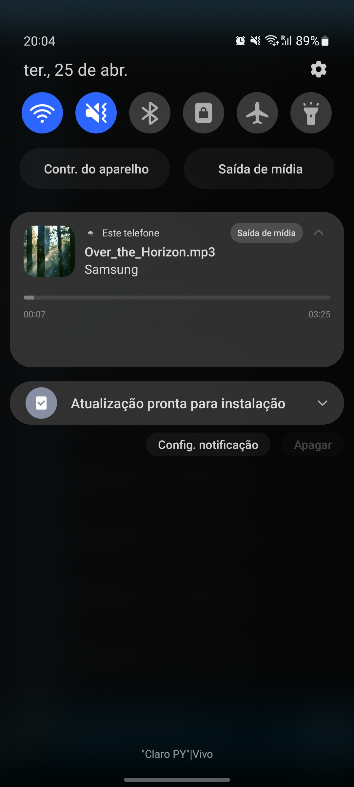
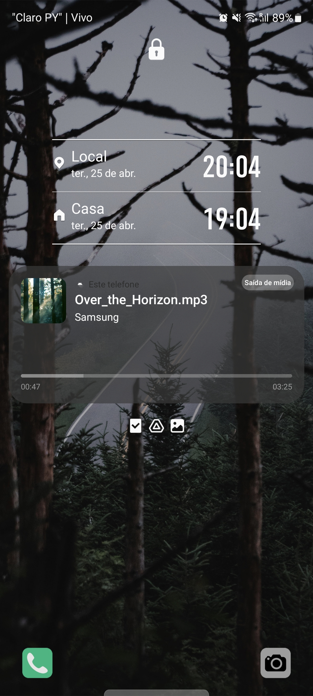
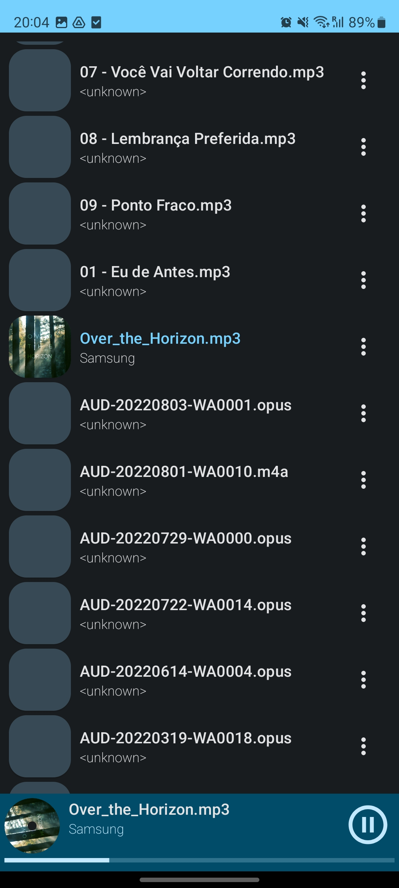
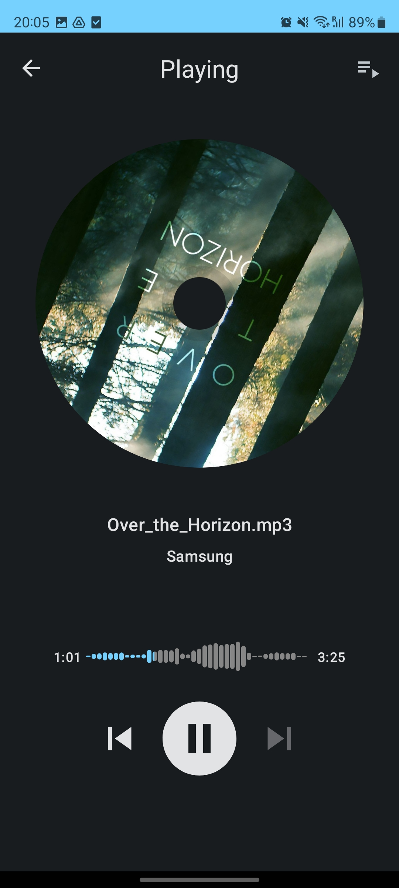

# Android Music App
he app allows users to browse their local music library and play songs. The main screen of the app displays a list of all the songs available in the device's local storage. Users can select a song from the list to play it.

The app also features basic music playback controls such as play, pause, skip forward, and skip backward. Additionally, there is a shuffle and repeat button that allows users to toggle between these modes.

The repository contains the source code for the app, including the UI layout files, the code for handling music playback, and the logic for fetching and displaying the list of available songs.

## Screenshots
   