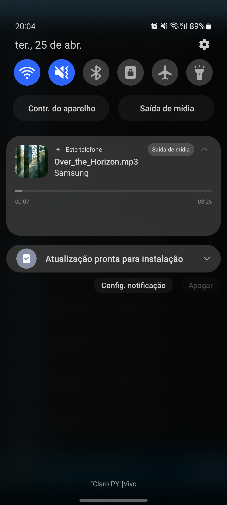
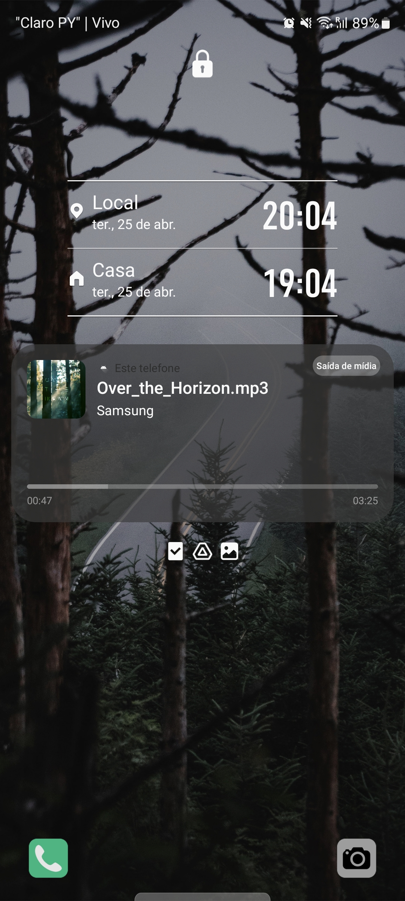
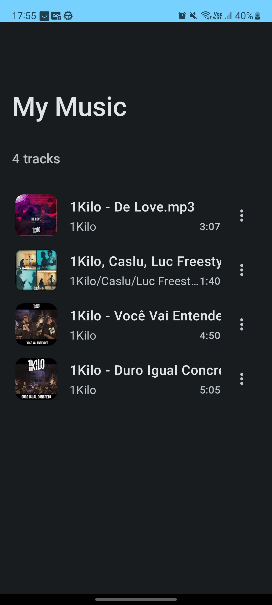
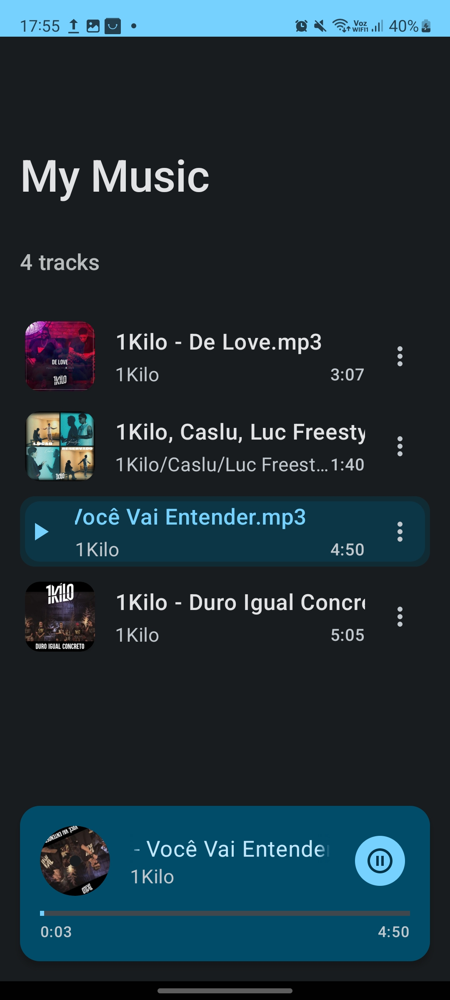
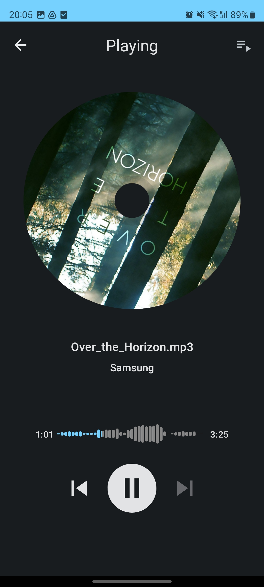

# 🎵 Vibra - Modern Android Music Player

[](https://kotlinlang.org)
[](https://android-arsenal.com/api?level=23)
[](https://developer.android.com/jetpack/compose)
[](https://developer.android.com/jetpack/guide)

A feature-rich, modern Android music player built with cutting-edge technologies and following industry best practices. This project demonstrates advanced Android development skills including Clean Architecture, MVVM pattern, Jetpack Compose, and audio visualization.

## ✨ Key Features

### 🎛️ **Advanced Audio Controls**
- **High-quality audio playback** with MediaSession integration
- **Smart playlist management** with reorderable tracks
- **Intuitive media controls**: Play, pause, skip, shuffle, repeat
- **Background playback** with notification controls
- **Audio focus management** for seamless user experience

### 🎨 **Modern UI/UX**
- **100% Jetpack Compose** - Latest declarative UI toolkit
- **Material Design 3** components and theming
- **Responsive layouts** optimized for different screen sizes
- **Smooth animations** and transitions
- **Dark/Light theme support**

### 📊 **Audio Visualization**
- **Real-time waveform visualization** using custom native libraries
- **Audio amplitude analysis** with FFmpeg integration
- **Interactive audio timeline** for precise navigation

### 🏗️ **Professional Architecture**
- **Clean Architecture** with clear separation of concerns
- **MVVM pattern** with ViewModels and StateFlow
- **Dependency Injection** using Dagger Hilt
- **Repository pattern** for data management
- **Use cases** for business logic encapsulation

## 🛠️ Technology Stack

### **Core Technologies**
- **Kotlin** - 100% Kotlin codebase
- **Jetpack Compose** - Modern declarative UI
- **Material Design 3** - Latest design system
- **Coroutines & Flow** - Asynchronous programming

### **Architecture & Patterns**
- **Clean Architecture** - Scalable and maintainable code structure
- **MVVM Pattern** - Clear separation between UI and business logic
- **Repository Pattern** - Centralized data access
- **Dependency Injection** - Dagger Hilt for IoC

### **Media & Audio**
- **MediaPlayer** - Core audio playback functionality
- **MediaSession** - Media controls integration
- **FFmpeg** - Advanced audio processing (via custom C++ library)
- **Audio visualization** - Custom waveform rendering

### **Development Tools**
- **Android API 23+** - Wide device compatibility
- **Gradle** - Modern build system
- **ProGuard** - Code optimization and obfuscation

## 📱 Screenshots

<div align="center">
  
  
   
  
</div>

## 🏛️ Architecture Overview

```
📦 vibra
├── 🎯 core/
│   ├── domain/          # Business logic & entities
│   └── infrastructure/ # Data sources & repositories
├── 🎨 screens/          # Compose UI screens
├── 🧩 components/       # Reusable UI components
├── 📱 activities/       # Android activities
├── 🔄 view_models/      # MVVM ViewModels
└── 💉 di/              # Dependency injection modules
```

### **Clean Architecture Layers**
1. **Domain Layer**: Contains business entities, use cases, and repository interfaces
2. **Data Layer**: Implements repositories, data sources, and handles data mapping
3. **Presentation Layer**: UI components, ViewModels, and Android-specific code

## 🚀 Technical Highlights

### **Performance Optimizations**
- **Lazy loading** of music library for improved startup time
- **Efficient memory management** with proper lifecycle handling
- **Background processing** for audio analysis and metadata extraction
- **Optimized list rendering** with Compose's LazyColumn

### **Audio Processing**
- **Custom C++ native library** for high-performance audio analysis
- **FFmpeg integration** for advanced audio format support
- **Real-time waveform generation** and visualization
- **Audio amplitude detection** for dynamic UI elements

### **User Experience**
- **Seamless background playback** with proper service implementation
- **System integration** with media notification controls
- **Responsive design** adapting to different screen orientations
- **Accessibility support** following Android guidelines

## 🔧 Installation & Setup

1. **Clone the repository**
   ```bash
   git clone https://github.com/yourusername/my_android_music_app.git
   ```

2. **Open in Android Studio**
   - Import the project in Android Studio Arctic Fox or later
   - Sync Gradle dependencies

3. **Build and Run**
   - Connect an Android device or start an emulator
   - Run the app (Minimum SDK: API 23)

## 📋 Permissions Required

- `READ_EXTERNAL_STORAGE` - Access music files on device
- `READ_MEDIA_AUDIO` - Android 13+ audio file access
- `INTERNET` - For potential online features
- `POST_NOTIFICATIONS` - Media playback notifications

## 🎯 Professional Development Showcase

This project demonstrates:

- ✅ **Modern Android Development** - Latest tools and practices
- ✅ **Clean Code Principles** - SOLID principles and clean architecture
- ✅ **Performance Optimization** - Efficient audio processing and UI rendering
- ✅ **User-Centered Design** - Intuitive and accessible interface
- ✅ **Production-Ready Code** - Proper error handling and edge cases
- ✅ **Cross-Platform Skills** - Native Android with C++ integration

## 🔮 Future Enhancements

- 🌐 **Online streaming** integration
- 🎵 **Lyrics display** and synchronization
- 📊 **Advanced audio effects** and equalizer
- ☁️ **Cloud sync** for playlists and preferences
- 🤖 **Machine learning** for music recommendations

## 📄 License

This project is part of a professional portfolio showcasing Android development expertise.

---

<div align="center">
  <strong>Built with ❤️ using modern Android development practices</strong>
</div> Music App
he app allows users to browse their local music library and play songs. The main screen of the app displays a list of all the songs available in the device's local storage. Users can select a song from the list to play it.

The app also features basic music playback controls such as play, pause, skip forward, and skip backward. Additionally, there is a shuffle and repeat button that allows users to toggle between these modes.

The repository contains the source code for the app, including the UI layout files, the code for handling music playback, and the logic for fetching and displaying the list of available songs.

